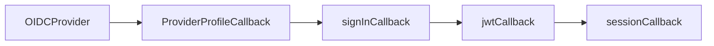

# NextAuth + Clave Única OIDC

## Introducción

Esta guía detallada te ayudará a integrar NextAuth.js con Clave Única utilizando OpenID Connect (OIDC). Clave Única es el sistema de autenticación del gobierno de Chile que permite a los ciudadanos acceder a múltiples servicios utilizando una sola cuenta. Al final de esta guía, tendrás una comprensión completa de cómo configurar NextAuth.js para autenticar usuarios a través de Clave Única, manejar los perfiles de usuario y gestionar las sesiones de autenticación.

## Comenzar con Next.js

Este proyecto está basado en [Next.js](https://nextjs.org) y fue creado con [`create-next-app`](https://nextjs.org/docs/app/api-reference/cli/create-next-app).

### Iniciar el Servidor de Desarrollo

Para iniciar el servidor de desarrollo, ejecuta:

```bash
pnpm dev
```

Abre [http://localhost:3000](http://localhost:3000) en tu navegador para ver el resultado.

Puedes comenzar a editar la página modificando `app/page.tsx`. La página se actualiza automáticamente a medida que editas el archivo.

Este proyecto utiliza [`next/font`](https://nextjs.org/docs/app/building-your-application/optimizing/fonts) para optimizar y cargar automáticamente [Geist](https://vercel.com/font), una nueva familia tipográfica de Vercel.

### Recursos de Next.js

Para aprender más sobre Next.js, revisa los siguientes recursos:

- [Documentación de Next.js](https://nextjs.org/docs) - Aprende sobre las características y API de Next.js.
- [Aprende Next.js](https://nextjs.org/learn) - Un tutorial interactivo de Next.js.
- [Repositorio de GitHub de Next.js](https://github.com/vercel/next.js) - Tus comentarios y contribuciones son bienvenidos.

## Run OpenID Connect Mock Server

Para levantar un servidor de prueba de OpenID Connect con una configuración personalizada para replicar Clave Única, puedes usar el siguiente comando:

```bash
node ./oidc/index.js
```

Asegúrate de tener un archivo de configuración en `./oidc/index.js` que defina los endpoints y parámetros necesarios para replicar el comportamiento de Clave Única.

### Ajuste de Variables de Entorno

Cuando uses el servidor mock, actualiza las variables de entorno para que apunten al servidor local:

```env
CLAVE_UNICA_URL=http://localhost:8080
CLAVE_UNICA_CLIENT_ID=mock-client-id
CLAVE_UNICA_CLIENT_SECRET=mock-client-secret
NEXT_PUBLIC_CLAVE_UNICA_LOGOUT_URL=https://accounts.claveunica.gob.cl/api/v1/accounts/app/logout?redirect=http://localhost:3000
```

Estas variables aseguran que la integración funcione correctamente con el servidor mock durante el desarrollo o pruebas.

## Configuración de NextAuth

En esta implementación, utilizamos NextAuth.js con la estrategia de sesión basada en JWT (JSON Web Tokens).

### Estrategia de Sesión: `jwt`

- **Descripción**: La estrategia `jwt` almacena el token de acceso en una cookie segura y firmada. Es una estrategia sin estado (*stateless*), lo que significa que no es necesario almacenar el token en una base de datos.
- **Ventajas**:
  - **Escalabilidad**: Al no depender de una base de datos para almacenar sesiones, es más fácil escalar horizontalmente.
  - **Seguridad**: Los tokens JWT están firmados y pueden incluir información adicional de manera segura.

## Integración con Clave Única OIDC

Para integrar Clave Única como proveedor de autenticación OIDC, es esencial configurar correctamente los endpoints y parámetros que proporciona Clave Única.


### Documentación de Clave Única

- **Guía de Integración**: [Enlace a la guía de integración](https://docs.google.com/document/d/16c0D2jVhuYOYGI9z4kC2aoNH8oWNA9v1cc3tXQ76TO0/edit?tab=t.0)
- **Guía Botón Clave Única**: [Enlace a la guía del botón Clave Única](https://drive.google.com/file/d/1XvPV-jfJKLg-1Gx1Qo26oAvkQ_tSmtZj/view)

### URLs y Endpoints de Clave Única

- **Issuer**: `https://accounts.claveunica.gob.cl/openid`
- **Configuración OIDC**: `https://accounts.claveunica.gob.cl/openid/.well-known/openid-configuration`
- **Authorization URL**: `https://accounts.claveunica.gob.cl/openid/authorize`
- **Token URL**: `https://accounts.claveunica.gob.cl/openid/token`
- **User Info (Profile) URL**: `https://accounts.claveunica.gob.cl/openid/userinfo`


### Definición del Tipo de Perfil de Clave Única

Es crucial definir el tipo de perfil que se recibirá de Clave Única para manejar correctamente los datos del usuario.

```typescript
type ClaveUnicaProfile = {
  sub: string; // RUT sin dígito verificador
  name: {
    nombres: string[];
    apellidos: string[];
  };
  RolUnico: {
    numero: number; // RUT sin dígito verificador
    DV: string;     // Dígito verificador
    tipo: string;   // Ejemplo: "RUN", "RUT", etc.
  };
};
```

### Configuración del Proveedor de Clave Única

A continuación, se muestra cómo configurar Clave Única como proveedor en NextAuth.js.

```typescript
const claveUnicaProvider: Provider = {
  id: "clave-unica",
  name: "Clave Única",
  type: "oidc",
  issuer: env.CLAVE_UNICA_URL,
  clientId: env.CLAVE_UNICA_CLIENT_ID,
  clientSecret: env.CLAVE_UNICA_CLIENT_SECRET,
  authorization: {
    params: {
      scope: "openid run name", // Scopes solicitados al proveedor
    },
  },
  idToken: false, // Indica si se debe solicitar el id_token (en este caso, no)
  checks: ["pkce", "nonce", "state"], // Mecanismos de seguridad adicionales
  /**
   * Callback que se ejecuta después de obtener el perfil del usuario desde Clave Única.
   * Permite transformar y adaptar el perfil según las necesidades de la aplicación.
   * El perfil resultante se utiliza en los callbacks `jwt` y `session`.
   *
   * @param profile - Perfil del usuario obtenido desde Clave Única.
   * @returns Objeto con el perfil adaptado para NextAuth.
   */
  profile(profile: ClaveUnicaProfile) {
    // Construir el nombre completo del usuario concatenando los nombres y apellidos
    const fullName =
      profile.name.nombres.join(" ") + " " + profile.name.apellidos.join(" ");

    // Construir el identificador único del usuario utilizando el número y dígito verificador del RUT
    const id = `${profile.RolUnico.numero}-${profile.RolUnico.DV}`;

    // Retornar el perfil adaptado con los campos requeridos por NextAuth
    return {
      id: id, // Identificador único del usuario (e.g., "12345678-9")
      sub: id, // Identificador de sujeto utilizado internamente
      name: fullName, // Nombre completo del usuario
      given_name:
        profile.name.nombres.length > 0 ? profile.name.nombres[0] : null, // Primer nombre
      family_name:
        profile.name.apellidos.length > 0
          ? profile.name.apellidos.join(" ")
          : null, // Apellidos
      middle_name:
        profile.name.nombres.length > 1
          ? profile.name.nombres.slice(1).join(" ")
          : null, // Nombres adicionales
      locale: "es-CL", // Configuración regional
      RolUnico: profile.RolUnico, // Información del RUT
      nombreRaw: profile.name, // Nombres y apellidos sin procesar
    };
  },
};
```

**Explicación de los parámetros:**

- **`id`**: Identificador único del proveedor en NextAuth.js.
- **`name`**: Nombre legible del proveedor.
- **`type`**: Tipo de proveedor, en este caso `oidc`.
- **`issuer`**: URL base del proveedor OIDC. Next Auth utilizará esta URL para descubrir y configurar los endpoints necesarios.
- **`clientId`** y **`clientSecret`**: Credenciales de la aplicación registrada en Clave Única. Recuerda agregar estos valores a tus variables de entorno.
- **`authorization.params.scope`**: Scopes solicitados durante la autorización (`openid run name`).
- **`idToken`**: Indica si se debe solicitar el `id_token`; en este caso, `false` porque se manejará el perfil con `userinfo`.
- **`checks`**: Mecanismos de seguridad utilizados; `pkce` y `nonce` son recomendados.
- **`profile(profile)`**: Callback para manipular el perfil obtenido del proveedor.

## Flujo de Callbacks en NextAuth durante el Inicio de Sesión

Cuando un usuario inicia sesión, NextAuth sigue un flujo de callbacks que permiten manipular y gestionar la información del usuario y la sesión.



1. **OIDCProvider**: El usuario es redirigido a Clave Única para autenticarse.
2. **ProviderProfileCallback**: Se obtiene el perfil del usuario y se ejecuta el callback `profile`.
3. **signInCallback**: (Opcional) Determina si el usuario puede iniciar sesión.
4. **jwtCallback**: Se manipula el token JWT que se almacenará.
5. **sessionCallback**: Se define qué datos estarán disponibles en la sesión del usuario en el cliente.

### Ejemplo de Perfil de Clave Única

Antes de pasar por el callback `profile`, el perfil recibido de Clave Única tiene la siguiente estructura:

```json
{
  "sub": "12345678",
  "RolUnico": {
    "numero": 12345678,
    "DV": "9",
    "tipo": "RUN"
  },
  "name": {
    "nombres": ["María", "José"],
    "apellidos": ["López", "Fernández"]
  }
}
```

### Resultado del Callback `profile`

Después de procesar el perfil, obtenemos:

```json
{
  "id": "12345678-9",
  "sub": "12345678-9",
  "name": "María José López Fernández",
  "given_name": "María",
  "family_name": "López Fernández",
  "middle_name": "José",
  "locale": "es-CL",
  "RolUnico": {
    "numero": 12345678,
    "DV": "9",
    "tipo": "RUN"
  },
  "nombreRaw": {
    "nombres": ["María", "José"],
    "apellidos": ["López", "Fernández"]
  }
}
```

## Detalle de los Callbacks de NextAuth

### Callback `jwt`

El callback `jwt` se utiliza para manipular el token JWT que se almacena en la cookie de sesión.

**Implementación:**

```typescript
callbacks: {
  jwt({ trigger, token, account, profile, user }) {
    /*
     * Se llama al crear o actualizar el JWT usado para la sesión.
     * Los triggers pueden ser "signIn", "update" o "signUp".
     */

    if (trigger === "signIn" && account?.provider === "clave-unica") {
      token.id = account.providerAccountId;
      token.sub = account.providerAccountId;
    }
    return token;
  },
  // ...
}
```

**Explicación:**

- Si el trigger es `signIn` y el proveedor es `clave-unica`, asignamos `id` y `sub` al token utilizando `account.providerAccountId`, que contiene el identificador del usuario en Clave Única.

**Ejemplo de Token antes y después del Callback:**

- **Antes:**

  ```json
  {
    "name": "María José López Fernández",
    "sub": "uuid-autogenerado"
  }
  ```

- **Después:**

  ```json
  {
    "name": "María José López Fernández",
    "sub": "12345678-9",
    "id": "12345678-9"
  }
  ```

### Callback `session`

El callback `session` determina qué información estará disponible en la sesión del usuario en el cliente.

**Implementación:**

```typescript
callbacks: {
  // ...
  session({ session, token }) {
    /*
     * Se llama cada vez que se verifica la sesión.
     * La información retornada está accesible desde el cliente.
     */

    if (token?.id && session.user) {
      session.user.id = token.id;
    }
    return session;
  },
},
```

**Explicación:**

- Si el token contiene `id`, lo asignamos a `session.user.id` para que esté disponible en el cliente.

**Ejemplo de Sesión antes y después del Callback:**

- **Antes:**

  ```json
  {
    "user": {
      "name": "María José López Fernández"
    },
    "expires": "2024-12-19T20:30:47.746Z"
  }
  ```

- **Después:**

  ```json
  {
    "user": {
      "name": "María José López Fernández",
      "id": "12345678-9"
    },
    "expires": "2024-12-19T20:30:47.746Z"
  }
  ```

## Proceso Completo de Autenticación

1. **Inicio de Sesión**: El usuario selecciona iniciar sesión con Clave Única.
2. **Redirección**: Es redirigido al portal de Clave Única.
3. **Autenticación**: El usuario ingresa sus credenciales y se autentica.
4. **Retorno**: Clave Única redirige al usuario de vuelta a la aplicación.
5. **Obtención del Perfil**: NextAuth obtiene el perfil del usuario.
6. **Callback `profile`**: Se procesa y adapta el perfil.
7. **Callback `jwt`**: Se crea o actualiza el token JWT.
8. **Callback `session`**: Se establece la información de sesión disponible en el cliente.
9. **Acceso**: El usuario tiene acceso a las secciones protegidas de la aplicación.

## Declaración de Tipos y Extensiones

Para personalizar las interfaces de NextAuth y agregar propiedades adicionales, es necesario declarar módulos y extender las interfaces existentes.

```typescript
declare module "next-auth/jwt" {
  interface JWT {
    id?: string | null | undefined;
  }
}
```

**Explicación:**

- **Extensión de `JWT`**: Añadimos la propiedad `id` al token JWT para almacenar el identificador del usuario.

## Configuración de Páginas Personalizadas

En la configuración de NextAuth, puedes definir rutas personalizadas para las páginas de inicio de sesión y errores.

```typescript
pages: {
  signIn: "/ingresar",
  error: "/auth/error",
},
```

**Explicación:**

- **Página de Inicio de Sesión**: Se establece `/ingresar` como la ruta personalizada para iniciar sesión.
- **Página de Error**: Se establece `/auth/error` para mostrar errores de autenticación.

## Configuración Completa de NextAuth

Aquí se presenta la configuración completa de NextAuth con el proveedor de Clave Única y los callbacks personalizados.

```typescript
export const authConfig = {
  debug: env.NODE_ENV === "production" ? false : true,
  providers: [claveUnicaProvider],
  pages: {
    signIn: "/ingresar",
    error: "/auth/error",
  },
  callbacks: {
    jwt({ trigger, token, account, profile, user }) {
      if (trigger === "signIn" && account?.provider === "clave-unica") {
        token.id = account.providerAccountId;
        token.sub = account.providerAccountId;
      }
      return token;
    },
    session({ session, token }) {
      if (token?.id && session.user) {
        session.user.id = token.id;
      }
      return session;
    },
  },
} satisfies NextAuthConfig;
```

## Consideraciones Finales

- **Scopes Adecuados**: Asegúrate de solicitar los scopes necesarios para obtener la información requerida del usuario. En este caso, `openid run name` son esenciales para obtener el RUT y el nombre.
- **Seguridad de Datos**: Maneja correctamente los tokens y evita exponer información sensible en el cliente.
- **Pruebas Exhaustivas**: Realiza pruebas completas del flujo de autenticación para garantizar que todo funcione correctamente.
- **Depuración**: Utiliza el modo de depuración (`debug: true`) en entornos de desarrollo para facilitar la identificación de problemas.

## Recursos Adicionales

- **Documentación Oficial de NextAuth.js**: [https://next-auth.js.org/](https://next-auth.js.org/)
- **Información sobre OIDC**: [OpenID Connect](https://openid.net/connect/)

## Resumen

Este proyecto combina la potencia de Next.js con la flexibilidad de NextAuth.js para integrar Clave Única como proveedor de autenticación. Además, aprovecha las características avanzadas de Next.js, como la optimización de fuentes y el desarrollo rápido con recarga automática. Sigue esta guía para implementar una solución robusta y escalable en tu aplicación.

**¡Ahora estás listo para implementar y aprovechar al máximo esta configuración en tu proyecto!**